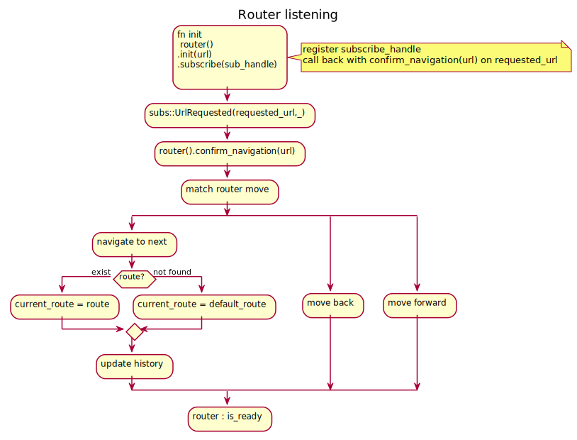
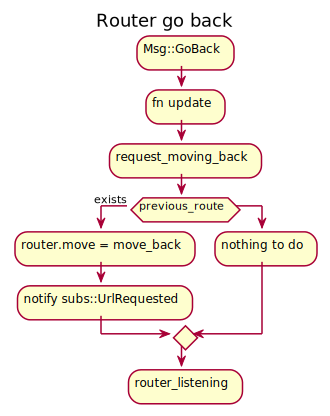

## Seed Routing

A try to make a Router that we could use to make a good routing for Seed equivalent to what we have in Angular/React/Vue.


### Rules

Here are the rules I try to respect
- Respect for TEA
- One single path of truth
- Minimize the boilerplate and the risks of bugs
- Easy API so we can follow the flow of an app
- Making routing  in TEA should be as easy as in Angular
- Making transition from other front end framework as easy as possible

### Motivations

My idea and motivation come mainly from the fact that I had a very bad experience with large App in Elm.

I got pain there with :
- Routing was absent
- Single path of truth is hard to see
- How to add and load components was not framed
- Need to update 5 or 6 files code in order to just add a tiny component
- Could not see guards

I also got a lot of happiness doing routing in Angular
- Routes are easy to write with the path, guard and component or module to load
- Sub routes are easy since you add them to sub modules and they are added automatically later on
- Lazy loading is easy
- Guarding routes is easy
- You can pass data to routes
- The router is easy to use via dependency injection at runtime
- RouterLink is OP in html template
```html
<a [routerLink]="['/user/bob']" [queryParams]="{debug: true}" queryParamsHandling="merge">
  link to user component
</a>
```
- Management state from the router is possible with Ngrx
- Little code in html

```html
    <router-outlet></router-outlet>
```
- Routing is framed as a standard in Angular so you know where to find consistent information to make good routing


The discussion regarding routing in seed is there https://github.com/seed-rs/seed/issues/383

### Description


This repos actually contains 2 distinct but linked concepts :

- A **router** for : 
    - Managing history.
    - Go back.
    - Go forward .
    - Use default route.
    - Standard navigation
    - You know if you can go back of forward and display it on UI easy.


- Derive macro for generating Url and/or call (almost)full TEA Module functions( init & view and parent Model for now ) .

    - With **AsUrl** , you can easily convert URL for all your enums and vis versa.
    - With **RoutingModules**, you will get :
        - Nested route / children routes.
        - Id parameter / dynamic urls.
        - Search query / query parameters.
        - Guard with protected routes :
            - Inject the model you need.
            - Give you a view to display when access is deny.
            - Will display the right view in the router.view().
        - init function calls & match automatically ( not protected but we could to it => Todo) :
            - Has access to URL payload ( query, id & children) .
            - Let you init your model from the previous state.
            - Let you init your model based on Url payload ( Awesome :D ).
        - view function calls & Match.
            - Has access to children & nested .
            - Is accessible only if condition are true from the guard.
       

### Example code

 ```rust

 fn init(url: Url, orders: &mut impl Orders<Msg>) -> Model {
     orders
         .subscribe(Msg::UrlChanged)
         .subscribe(Msg::UrlRequested)
         .subscribe(Msg::UserLogged);

     let mut router: Router<Routes> = Router::new();
     router.init_url_and_navigation(url);

     Model {
         theme: Theme::default(),
         register: Default::default(),
         login: Default::default(),
         dashboard: Default::default(),
         admin: Default::default(),
         router,
         logged_user: None,
     }
 }

 struct Model {
     pub register: pages::register::Model,
     pub login: pages::login::Model,
     pub dashboard: pages::dashboard::Model,
     pub admin: pages::admin::Model,
     router: Router<Routes>,
     logged_user: Option<LoggedUser>,
     theme: Theme,
 }

 #[derive(Debug, PartialEq, Clone, RoutingModules)]
     pub enum Routes {
         Other {
             id: String,
             children: Settings,
         },
         #[guard = "logged_user => admin_guard => not_authorized_view"]
         Admin { // will load module "admin.rs"
          // will load model.admin and as well
          // will check init has correct arguments
          // will check view has correct arguments
             query: IndexMap<String, String>,
         },
         #[guard = "logged_user => user_guard => not_logged_user_view"]
         Dashboard(DashboardRoutes), // will load module "dashboard"
         Profile { // will load module "profile"
             id: String,
         },
         #[guard = "logged_user => admin_guard => not_authorized_view"]
         #[view = " => my_stuff"]
         MyStuff,
         #[view = " => not_found"]
         #[default_route]
         NotFound,
         #[view = " => home"]
         #[as_path = ""]
         Root,
     }


 fn update(msg: Msg, model: &mut Model, orders: &mut impl Orders<Msg>) {
     match msg {
         Msg::UrlChanged(subs::UrlChanged(url)) => {
             model.router.confirm_navigation(url);
             if let Some(current_route) = model.router.current_route.clone() {
                 current_route.init(model, orders);
             }
         }
         // ...remaining arms
     }
 }

 fn view(model: &Model) -> impl IntoNodes<Msg> {
     vec![
         header(&model),
         if let Some(route) = &model.router.current_route {
             route.view(model)
         } else {
             home(&model.theme)
         },
     ]
 }

 ```


### Router life cycle

#### The router listens to Url changes



#### You can request to move back



Then we go back to the router listening

#### You can request to move forward


Then we go back to the router listening


### Use the example
```bash
cd exanples/backbone_app
```


```bash
cargo make watch 

cargo make serve
```

Open [127.0.0.1:8000](http://127.0.0.1:8000) in your browser.

### Author

[arn-the-long-beard](https://github.com/arn-the-long-beard)

### Contributors

[mankinskin](https://github.com/mankinskin)

### Sources

https://github.com/mankinskin/enum_paths

https://github.com/TatriX/seed-router